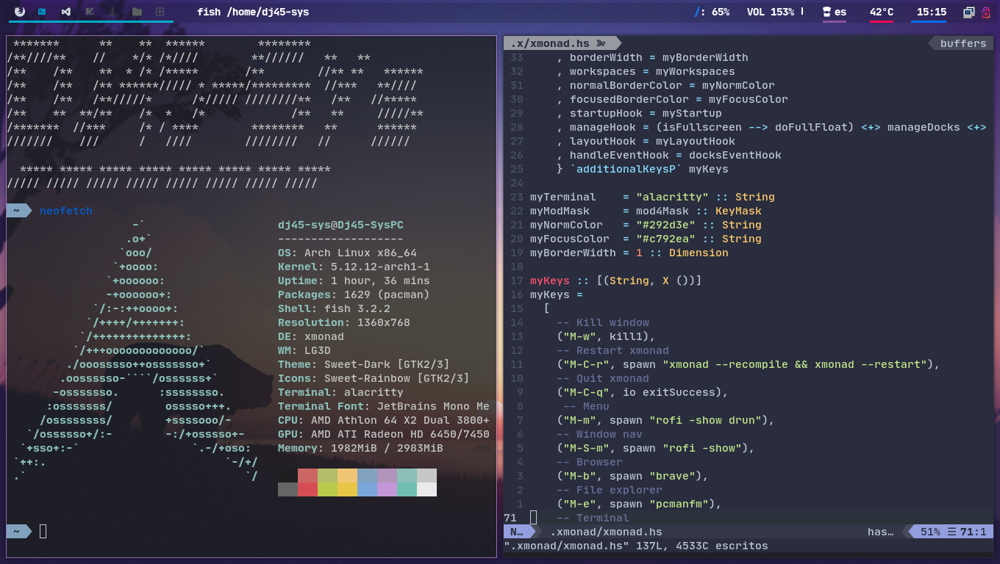
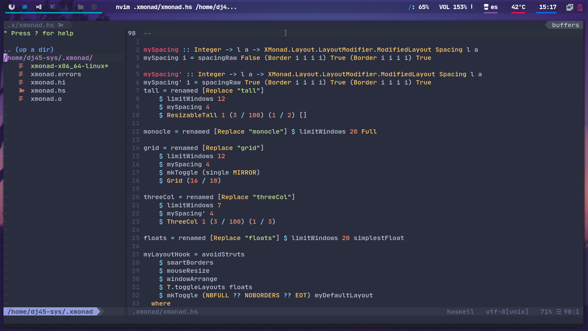
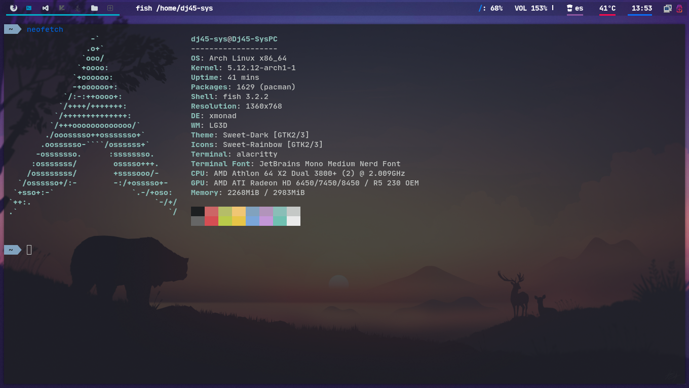
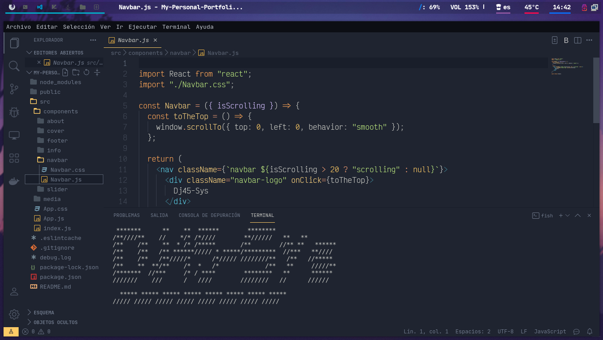

# Dj45-Sys's Dotfiles

  

## Table Of Contents

- [My Configs](#my-configs)
  - [VS Code Configs](#vs-code-configs)
- [FaQs](#faqs)
  - [How to install Arch Linux](#how-to-install-archlinux)
  - [How to install](#how-to-install)
- [Screenshots](#screenshots)
  - [Xmonad & Polybar](#xmonad--polybar)
  - [Neovim](#neovim)
  - [Alacritty & Fish](#alacritty--fish)
  - [VS Code](#vs-code)

## My Configs:

| Config               | To                                                                        |
| -------------------- | ------------------------------------------------------------------------- |
| **OS:**              | [Arch BTW](https://bit.ly/3j8H7ej)                                        |
| **Window Managers:** | [Xmonad](./.xmonad/)                                                      |
| **Status Bars:**     | [Polybar](./.config/polybar/)                                             |
| **Editors:**         | <ul><li>[Neovim](./.config/nvim/)</li><li>[Vscode](#vs-code-configs)</li> |
| **Terminal:**        | [Alacritty](./.config/alacritty)                                          |
| **Shell:**           | [Fish](https://bit.ly/3gQ71lw)                                            |
| **Fish Plugins:**    | [OMF - Oh My Fish](https://bit.ly/3gQGhla)                                |
| **OMF Theme**        | <a href="#htiatomf">Agnoster</a>                                          |
| **Icons:**           | <a href="https://bit.ly/3j27d2O">Candy Icons</a>                          |
| **Cursor:**          | <a href="https://bit.ly/3qp18zc">Sweet Cursors</a>                        |

### VS Code Configs:

<pre>
Font: VictorMono Nerd Font
Color Theme: Ayu Mirage
Files Icons: Ayu
Product Icons: Bootstrap Icons
</pre>

# FaQs:

## How to install ArchLinux:

First: [Here](https://wiki.archlinux.org/title/Installation_guide)  
After: [Here](https://github.com/antoniosarosi/dotfiles#arch-installation)

## How to Install :

Assuming you use ArchLinux

| Apps             | Command                                                                                              |
| ---------------- | ---------------------------------------------------------------------------------------------------- |
| **Yay:**         | `sudo pacman -S git`  `git clone https://aur.archlinux.org/yay.git`   `cd yay & makepkg -si` |
| **Alacritty**    | `sudo pacman -S alacritty`                                                                           |
| **Fish**         | `sudo pacman -S fish`                                                                                |
| **OMF**          | `sudo pacman -S curl`   `curl -L https://get.oh-my.fish \| fish`                                 |
| **Agnoster OMF** | `omf install agnoster`                                                                               |
| **Xmonad:**      | `sudo pacman -Sy xmonad xmonad-contrib`                                                              |
| **Polybar**      | `yay -S polybar`                                                                                     |
| **Neovim:**      | `yay -Sy neovim-nightly-bin`                                                                         |
| **VS Code**      | `yay -Sy visual-studio-code-bin`                                                                     |

# Screenshots:

## Xmonad & Polybar:

## Neovim:

## Alacritty & Fish

## VS Code

