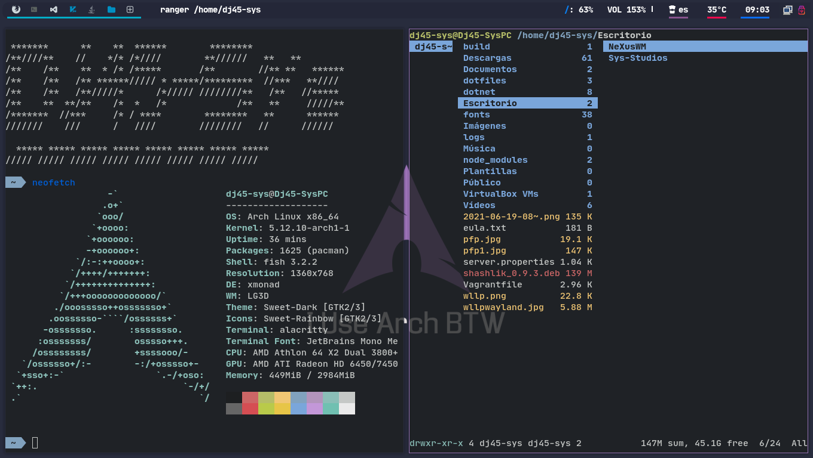
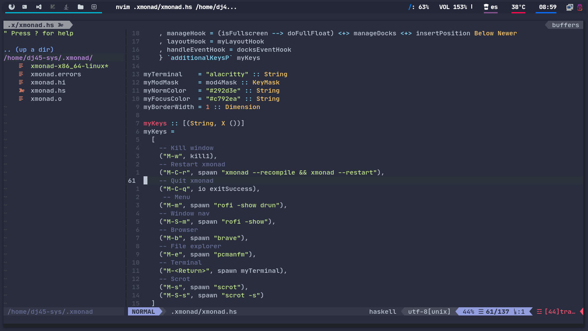

# Dj45-Sys's  Dotfiles

## Configs:
- Window Managers:
    - <a href="./.xmonad/">Xmonad</a>
- Status Bars:
    - <a href="./.config/polybar/">Polybar</a>
- Editors:
    - <a href="./.config/nvim/">Neovim</a>

# Screenshots:

## Xmonad & Polybar:

## Neovim:

